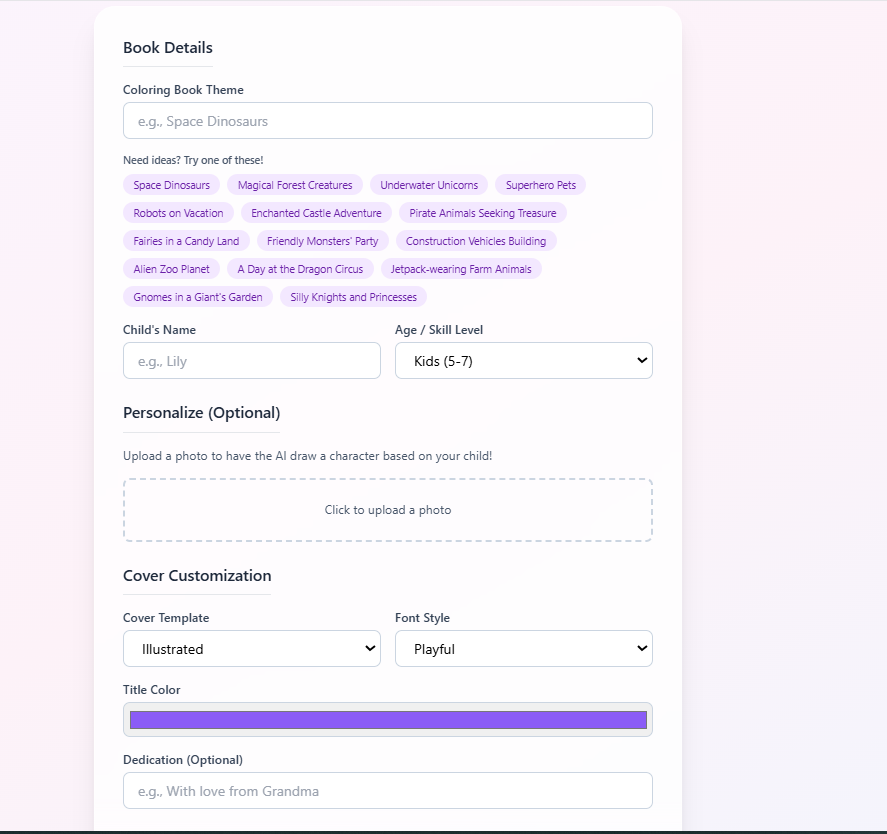
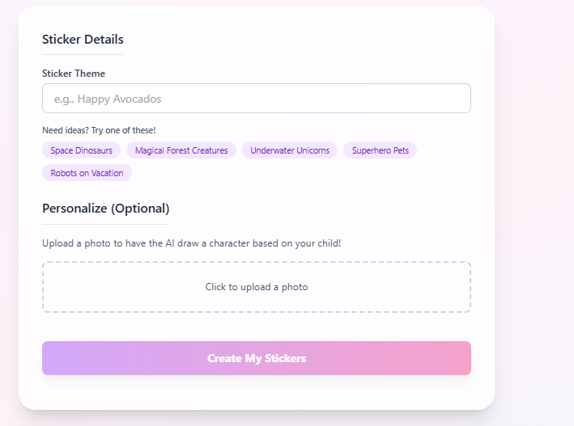
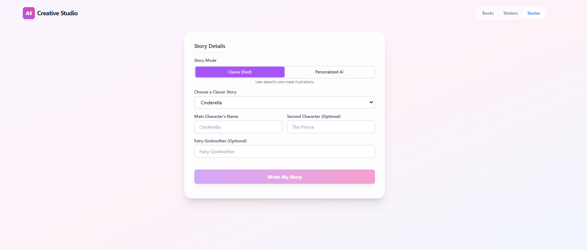

# AI Creative Studio

> **Where Imagination Becomes Art.** 

   

Transform your child's favorite ideas into **personalized coloring books**, **vibrant stickers**, and **enchanting storybooks** using the power of Google's Gemini AI. 

---

ook Forms* | *Custom Sticker Themes* | *Classic and AI Story Modes* |

---

## Sample Coloring Book: Friendly Monsters Party

Below is a complete **9-page preview** of a personalized coloring book generated for "Yousaf".

| Page 1: Custom Cover | Page 2: Personalized Character | Page 3: Fun Scene |
| :---: | :---: | :---: |
|  |  |  |
| **Page 4: Amazing Maze** | **Page 5: Connect the Dots** | **Page 6: Find the Items** |
|  |  |  |
| **Page 7: Name Tracing** | **Page 8: Fun Pattern** | **Page 9: Coloring Award** |
|  |  |  |

---

## 📸 Project Gallery & Results

See the AI Creative Studio in action!

###  Download Sample Result
Want to see the full quality? Download the generated PDF below:
 **[Download My-Coloring-Book.pdf](./My-Coloring-Book.pdf)**

###  UI Screenshots
| Dashboard View | Sticker Generation | Story Mode |
| :---: | :---: | :---: |
|  |  |  |

---

## 🚀 Core Features

### 📖 Coloring Book Generator
*   **Infinite Themes**: From Space Dinosaurs 🦕 to Magical Forest Creatures 🦄.
*   **Child's Name Integration**: Every page is personalized with custom captions and name-tracing activities.
*   **AI Character Clone**: Upload a photo, and the AI sketches your child into the adventure.
*   **Print-Ready PDFs**: Professionally formatted for standard home printing.

### Sticker Maker
*   **Die-Cut Style**: Generates stickers with a classic white vinyl border.
*   **Batch Creation**: Generates 9 unique designs per theme in one click.
*   **Flexible Exports**: Download as a high-quality PDF sheet or a ZIP of individual PNGs.

### Story Teller
*   **Classic Meets Modern**: Choose a classic tale and swap characters for real-life friends.
*   **Two Artistic Modes**:
    *   **Classic**: Fast, beautiful pre-made illustrations.
    *   **AI-Driven**: Unique, custom-generated art for every single scene.

### Friendly AI Assistant
*   A magical companion is always available to help brainstorm themes or answer questions.

---

## Technical Overview

The studio is designed as a modern creative workshop featuring:
- **Glassmorphism**: Soft, blurred backgrounds for an airy feel. 
- **Vibrant Gradients**: A signature palette of Purple, Pink, and Blue.
- **Playful Animations**: Elements scale and fade into view smoothly.
- **Kid-Friendly UI**: Large, accessible buttons and clear visual progress bars. 

---

##  Tech Stack

| Technology | Purpose |
| :--- | :--- |
| **Google Gemini API** | Text & Image generation |
| **React 19** | UI Logic & Components |
| **Tailwind CSS** | Responsive, modern design |
| **jsPDF / JSZip** | PDF and Archive generation |

---

##  Getting Started

### 1. Configure the API Key
Obtain a Gemini API Key from [Google AI Studio](https://aistudio.google.com/app/apikey).
Set it in your environment settings:
```json
"env": {
  "API_KEY": "YOUR_SECRET_KEY"
}
```

### 2. Launch the Studio
Open `index.html` in a modern browser.

---
*Created for the next generation of artists.* 
